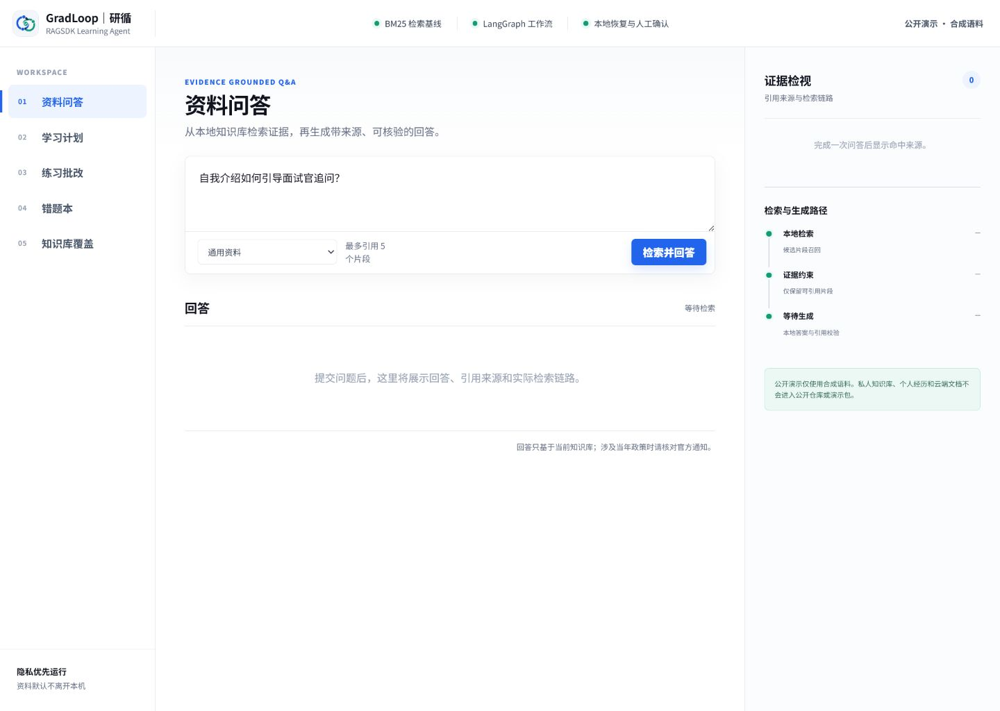

# GradLoop RAGSDK Agent

A privacy-first RAG and learning-agent project for postgraduate admission
preparation. The public package provides a reproducible CPU baseline, synthetic
evaluation data, release safety checks, and an optional adapter boundary for
Huawei Ascend RAGSDK.

The CPU baseline does not bundle model weights, personal documents, databases,
credentials, or RAGSDK source code. RAGSDK remains an independently provisioned
external dependency; see [NOTICE](NOTICE) for licensing and attribution.
An optional MiniCPM-o client boundary accepts only explicitly confirmed public
or synthetic media. Model weights and the Ascend inference service remain
external, and the application does not persist uploaded media or original file
names.

## MAP realtime competition demo

The public innovation-track demo is available at
<https://gradloop-ragsdk-omni.pages.dev>. It uses a Cloudflare Worker as a
credential-holding WebSocket proxy for MAP MiniCPM-o 4.5 Realtime. The live
chat lifecycle has a real smoke result; browser audio/video acceptance remains
`not_run` until it is exercised with explicit user permission. The public site
contains only synthetic assets and never reads a private corpus. Deployment,
recovery codes, and secret boundaries are documented in
[docs/competition/deployment.md](docs/competition/deployment.md).

## Quick start

Python 3.11 or 3.12 is supported:

```powershell
python -m venv .venv
.\.venv\Scripts\python.exe -m pip install -e ".[dev]"
.\.venv\Scripts\python.exe scripts\public_release_scan.py
.\.venv\Scripts\python.exe scripts\run_public_demo.py
```

Open `http://127.0.0.1:8000/`. The public-demo launcher binds only to the
loopback interface and explicitly overrides every corpus, question-bank, state,
and coverage path so an existing private local store cannot take precedence.

## Public evaluation

Run the isolated one-command public portfolio evaluation:

```powershell
.\.venv\Scripts\python.exe scripts\evaluate_public_portfolio.py
```

It uses only versioned synthetic fixtures and public aggregate reports. Its
results are regression evidence, not real-user accuracy and not proof of a
working RAGSDK runtime.

Synthetic-data UI example:



## Container baseline

```powershell
docker compose --profile cpu up --build
```

The container runs as a non-root user, persists state in a named volume, and
publishes the application only on `127.0.0.1:8000` by default. It includes the
20-document synthetic public corpus and a five-question synthetic practice
bank, but no personal corpus or model weights.
After startup, verify both `http://127.0.0.1:8000/health` and
`http://127.0.0.1:8000/ready`.

The versioned local validation evidence is stored in
[`reports/public/docker_cpu_baseline_validation_v1.json`](reports/public/docker_cpu_baseline_validation_v1.json).

## Build the public package

Do not archive the working directory. Build only the versioned manifest:

```powershell
.\.venv\Scripts\python.exe scripts\build_public_release.py --output <empty-output-directory>
```

The builder renames this public README to `README.md`, creates a SHA-256 file
manifest, and rescans the finished release tree before reporting success.

## Documentation

- [Release and reproducibility guide](docs/release.md)
- [2–4 minute public demo](docs/demo-script.md)
- [Troubleshooting](docs/troubleshooting.md)
- [MiniCPM-o multimodal integration](docs/minicpmo-integration.md)
- [One-key MAP realtime setup](docs/competition/one-key-map-setup.md)
- [Apache-2.0 license](LICENSE)
- [Attribution and RAGSDK boundary](NOTICE)
