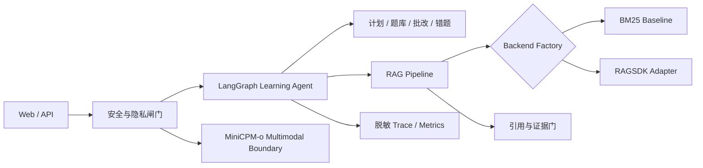

# GradLoop RAGSDK Omni

> 证据约束的全模态学习与面试训练 Agent

[](https://www.python.org/)
[](https://fastapi.tiangolo.com/)
[](https://github.com/langchain-ai/langgraph)
[](https://gitcode.com/Ascend/RAGSDK)
[](LICENSE)
[](docs/release.md)

GradLoop 将可引用的 RAG 问答、有界 Agent 工作流、全模态理解和学习闭环组合在同一个可审计系统中。它面向课程学习、技术面试和科研答辩等场景，不只给出答案，还保留证据、记录薄弱项，并在需要改动学习计划时要求用户确认。

本仓库负责应用、API、UI 与学习闭环；[独立 Training 工程](https://github.com/Iroha-P/gradloop-ragsdk-omni-training)负责数据、模型实验和模型服务。项目用途与维护、归档边界见 [项目指南](PROJECT_GUIDE.md)，协作规则见 [AGENTS](AGENTS.md)。私人旧 Coach 仅在本地归档，不属于公开发布内容。

**[Online Demo](https://gradloop-ragsdk-omni.pages.dev)** · **[Architecture](docs/architecture.md)** · **[Reproducibility](docs/release.md)** · **[Demo Guide](docs/demo-script.md)**


## 项目亮点

- **证据约束 RAG**：统一 BM25 baseline、RAGSDK 适配层和测试后端；回答携带引用、后端身份和脱敏 trace，证据不足时拒答。
- **有界 Agent 编排**：LangGraph 与显式 baseline 共用业务工具，限制工具步数和重试次数，对计划调整使用 human-in-the-loop 确认。
- **学习闭环**：把资料问答、学习计划、练习出题、答案批改、错题记录和重练串成可恢复的状态流程。
- **全模态扩展**：通过 MiniCPM-o 4.5 边界处理文本、图像、音频和视频帧；应用侧只接受明确确认的公开或合成媒体。
- **隐私优先发布**：公开包仅包含源码、合成 fixtures、聚合指标和空配置示例；不包含私人语料、凭据、模型权重或原始评分记录。

## 公开 Demo

| 模块 | 公开页面行为 | 能力边界 |
| --- | --- | --- |
| 资料问答 | 公开合成回放 | 回答、引用与检索路径 |
| 全模态训练台 | MAP MiniCPM-o 4.5 Realtime | 实时文本交互；媒体只接受公开或合成内容 |
| 学习计划 | 公开合成回放 | 结构化任务、时长与产出 |
| 练习批改 | 公开合成回放 | 出题、双评分与弱项归纳 |
| 错题本 | 公开合成回放 | 错题记录、重练与掌握度更新 |
| 知识库覆盖 | 公开合成回放 | 来源、章节、候选题与冲突统计 |

> 公开 Demo 不连接私人知识库。五个本地专属模块使用确定性合成回放，全模态训练台通过 Cloudflare Worker 代理访问 MAP，密钥不进入浏览器或仓库。

## 系统架构



RAG 后端在启动时显式选择。当 `ragsdk` 不可用时，系统返回 `backend_unavailable`，不会静默伪装成 RAGSDK 运行。

## Quick Start

需要 Python 3.11 或 3.12：

```powershell
python -m venv .venv
.\.venv\Scripts\python.exe -m pip install -e ".[dev]"
.\.venv\Scripts\python.exe scripts\public_release_scan.py
.\.venv\Scripts\python.exe scripts\run_public_demo.py
```

打开 <http://127.0.0.1:8000/>。公开启动器只绑定 loopback，并强制使用版本化合成资料和题库，不读取现有私人存储。

运行公开组合评测：

```powershell
.\.venv\Scripts\python.exe scripts\evaluate_public_portfolio.py
```

或启动隔离的 CPU 容器基线：

```powershell
docker compose --profile cpu up --build
```

启动后检查 <http://127.0.0.1:8000/health> 和 <http://127.0.0.1:8000/ready>。容器以非 root 用户运行，只发布到 `127.0.0.1:8000`，包含 20 份合成文档和 5 道合成练习题。

## 已验证证据

| 范围 | 版本化结果 | 诚实边界 |
| --- | --- | --- |
| CPU 公开基线 | Docker health `healthy`，20 份合成文档，Agent SSE 链路通过 | BM25 + LangGraph，不等于 RAGSDK runtime |
| MiniCPM-o 4.5 / Ascend | 文图、音频、图音、视频帧四路 smoke 通过 | 公开模型素材和聚合运行证据 |
| 应用 E2E | LangGraph + MiniCPM-o Ascend 公开图文请求通过 | 请求级保留，不写入输入内容 |
| 人工双评 | 2 名评分者、30 条五维评分；QWK `0.5645`，Pearson `0.7331` | 衡量量表一致性，不宣称模型质量提升 |

详细报告位于 [`reports/public/`](reports/public/)，其中 [MiniCPM-o 历史证据](reports/public/competition/minicpmo-live-evidence-2026-08-27.json)和 [人工双评 v3 状态](reports/public/human_grading_annotation_status_v3.json)对应版本化记录。公开合成评测不代表真实用户准确率，可观测指标也不代替语义评审；本次代码发布不重新执行 NPU、媒体设备或在线端点验收。

## 目录导航

```text
app/                 FastAPI、Agent、RAG 与学习工具
configs/             公开可复现配置
data/public_demo/    合成演示资料与题库
deploy/              MAP Realtime Worker 公开配置
docs/                架构、部署、隐私与演示文档
reports/public/      脱敏聚合评测证据
scripts/             发布、评测与安全扫描工具
tests/               单元、集成、隐私与发布契约测试
```

## 隐私与发布边界

- 不提交个人文档、成绩证明、身份信息、原始评分或本地知识库。
- 不提交 API Key、Cookie、绝对路径、模型权重或第三方受限内容。
- RAGSDK 是独立配置的外部依赖，本仓库不重新分发其源码。
- 构建公开包时只读取 [`release-manifest.json`](release-manifest.json) 白名单，生成 SHA-256 清单并对产物再扫描。

## 文档

- [系统架构](docs/architecture.md)
- [发布与可复现指南](docs/release.md)
- [MiniCPM-o 全模态集成](docs/minicpmo-integration.md)
- [MAP Realtime 部署](docs/competition/deployment.md)
- [2–4 分钟演示脚本](docs/demo-script.md)
- [故障排查](docs/troubleshooting.md)
- [开源许可](LICENSE)
- [第三方归属与 RAGSDK 边界](NOTICE)

## 当前状态

仓库提供 CPU baseline、合成演示 fixtures、发布扫描与组合评测的复现入口。在线 Demo 的当前可用性须以实时验收为准，历史证据不代表当前服务状态。RAGSDK 完整 runtime 需在满足 Linux、Milvus 和模型服务依赖的环境中单独配置；系统不会把 baseline 结果宣称为 RAGSDK 实测结果。

Apache-2.0 licensed. See [NOTICE](NOTICE) for attribution and external dependency boundaries.
