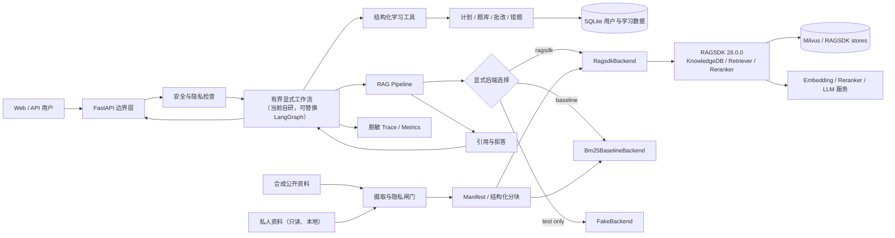
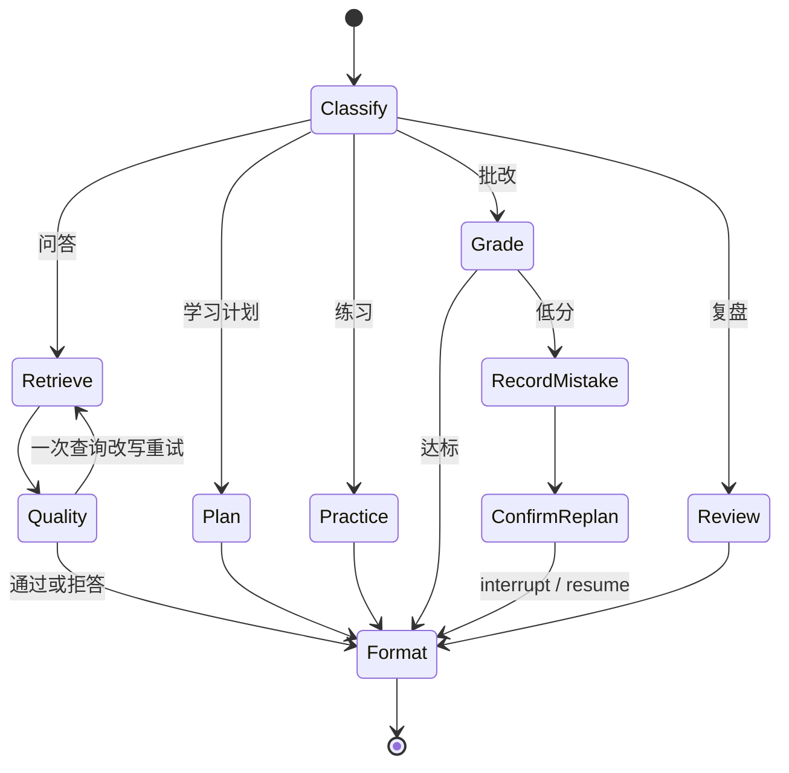

# 系统架构

版本：阶段 0 设计基线（2026-07-19）

## 1. 架构目标

系统把“保研业务规则”“Agent 工作流”“RAG 后端”“私人数据”分开，做到：

- 回答能回溯到文档片段和资料日期。
- 每次运行能看出实际后端，失败不会伪装成功。
- 公开 demo 可独立运行，不依赖私人资料。
- 学习计划、题库、批改、错题能形成有状态闭环。
- Windows 可开发和跑 baseline；Linux Python 3.11 环境验证真实 RAGSDK。

## 2. 组件图



## 3. 运行 profile

| Profile | 用途 | 后端 | 数据 | 失败行为 |
| --- | --- | --- | --- | --- |
| `local_baseline` | Windows 开发、CI、CPU demo | BM25 baseline | 合成公开数据 | 返回 baseline 身份；不尝试 RAGSDK |
| `test_fake` | 单元测试、确定性 E2E | FakeBackend + FakeLLM | fixtures | 固定结果；禁止生产启用 |
| `ragsdk_local` | Linux 低资源真实接口验证 | RAGSDK + Milvus Lite/可用本地组件 | 合成公开数据 | 缺依赖则 `backend_unavailable` |
| `ragsdk_full` | 完整检索/重排/生成实验 | RAGSDK + embedding/reranker/LLM 服务 | 公开评测集或确认后的私有本地数据 | 逐项暴露服务健康状态，禁止静默降级 |

## 4. 统一 RAG 后端协议

```python
class RagBackend(Protocol):
    def index_documents(self, documents: list[DocumentInput]) -> IndexResult: ...
    def delete_documents(self, document_ids: list[str]) -> DeleteResult: ...
    def retrieve(self, request: RetrievalRequest) -> RetrievalResult: ...
    def answer(self, request: AnswerRequest) -> AnswerResult: ...
    def healthcheck(self) -> BackendHealth: ...
    def backend_info(self) -> BackendInfo: ...
```

关键约束：

- `backend_info()` 返回稳定名称、版本、配置指纹和能力清单。
- `retrieve()` 返回候选、分数、检索类型、阶段耗时和脱敏 trace；不在普通日志写完整文本。
- `answer()` 始终返回引用、资料日期、警告和拒答状态。
- backend factory 只按配置选择一次；`ragsdk` 初始化失败时不实例化 baseline。
- FakeBackend 只能在测试配置中启用。

## 5. RAGSDK 实际适配链

### 5.1 摄取

```text
本项目隐私闸门
  -> 生成安全的 staging 文件与 manifest
  -> LoaderMng 注册 Markdown/TXT/PDF/DOCX loader 与 splitter
  -> EmbeddingFactory 或 TEIEmbedding
  -> KnowledgeStore.add_knowledge
  -> KnowledgeDB(... white_paths=[staging])
  -> upload_files(... embed_func={dense, sparse})
  -> 返回失败文件并核对知识库文档清单
```

私人原件不直接传给 `upload_files`。RAGSDK 的 `white_paths` 是第二道路径控制，不替代第一道敏感度和脱敏检查。

### 5.2 检索与生成

```text
query normalize
  -> Retriever（dense）与 FullTextRetriever（sparse，可用时）
  -> 去重
  -> MixRetrieveReranker（RAGSDK 内置融合）或项目实现的 RRF（配置明确）
  -> RerankerFactory 创建的 local/TEI reranker（可选）
  -> 引用构建与证据阈值检查
  -> Text2TextLLM / 可替换 LLMClient
  -> 结构化答案验证
```

若采用 `SingleText2TextChain`，适配层读取其 `result` 和 `source_documents`，再转换成统一响应；若需要精细的分阶段 trace，则直接编排 Retriever、Reranker 和 LLM 接口。

## 6. Agent 状态与路由

当前采用双引擎：真实 `LangGraphLearningAgent` 为默认引擎，原自研 `LearningAgent` 保留为 baseline。两者共享同一组 Pydantic 工具、业务服务和 SQLite 学习数据，因此可以在相同输入上比较编排层收益。

LangGraph v1 已落地的状态图如下：



状态图使用 `SqliteSaver` 保存执行位置。持久化 state 只包含匿名用户摘要、意图、作用域、节点、对象 ID、计数、错误类型和摘要散列；原问题、原回答、题目正文、检索文本和生成内容通过 run-scoped context 传递，不进入恢复点。故障恢复发生在安全节点边界，已完成节点不重复执行。

硬限制：最大 8 个工具步骤、最大一次检索重试、工具白名单、写操作幂等、人类确认后才调整重要计划。`BAOYAN_AGENT_ENGINE=baseline` 可切回最大 6 步的原显式工作流做对照。

## 7. 数据分区

| 分区 | 示例 | 可公开 | 默认保留策略 |
| --- | --- | --- | --- |
| 公共知识库 | 合成保研指南、公开课程材料 | 是 | 版本化，可重建 |
| 私人本地知识库 | 用户确认后的脱敏片段 | 否 | 本地、最少化、可删除 |
| 用户画像 | 目标、截止日期、时长、弱项 | 否 | SQLite，按用户隔离 |
| 学习记录 | 计划、任务、作答、错题 | 否 | 可查看、导出、删除 |
| 会话状态 | 当前请求所需上下文 | 否 | 短期，不保存完整无限历史 |
| 运行轨迹 | 后端、节点、耗时、错误、摘要 | 可脱敏公开 | 不含完整输入和上下文 |

## 8. 可观测与验证

每个请求至少生成 `request_id` 和 `trace_id`，记录：后端身份、配置版本、节点、工具、脱敏参数摘要、候选数量、引用数量、各阶段耗时、错误类型、重试次数、模型名与 token（若可用）。

阶段验证分四级，文档和 UI 必须使用同一套措辞：

1. `implemented`：代码存在。
2. `automated-test-passed`：fake/baseline 自动测试通过。
3. `ragsdk-contract-checked`：适配参数与当前源码一致，但未真实运行。
4. `ragsdk-runtime-verified`：在声明环境中运行真实 RAGSDK 集成测试通过。
